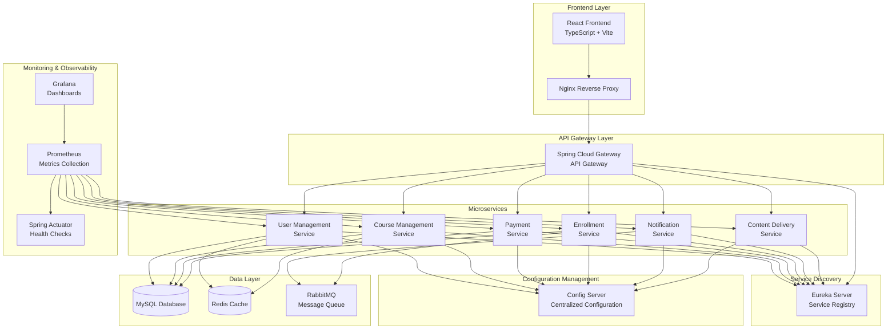

# Course Selling Platform - Complete Project Workflow

## 🏗️ Project Architecture Overview



## 🔄 Complete Development to Deployment Workflow

```mermaid
graph TD
    subgraph "Development Phase"
        DEV_START[Developer Starts Work]
        CODE[Write Code<br/>- Java Spring Boot<br/>- React TypeScript<br/>- Configuration Files]
        LOCAL_TEST[Local Testing<br/>- Unit Tests<br/>- Integration Tests<br/>- Manual Testing]
        COMMIT[Git Commit & Push<br/>to Feature Branch]
    end
    
    subgraph "CI/CD Pipeline (Jenkins)"
        TRIGGER[Pipeline Triggered<br/>by Git Webhook]
        CHECKOUT[Checkout Code<br/>from Repository]
        
        subgraph "Build Phase"
            BUILD_BE[Build Backend Services<br/>- Maven Build<br/>- Compile Java Code<br/>- Package JARs]
            BUILD_FE[Build Frontend<br/>- npm install<br/>- npm run build<br/>- Generate Static Files]
        end
        
        subgraph "Test Phase"
            UNIT_TEST[Unit Tests<br/>- JUnit (Backend)<br/>- Jest (Frontend)]
            INTEGRATION_TEST[Integration Tests<br/>- TestContainers<br/>- API Testing]
            E2E_TEST[End-to-End Tests<br/>- Selenium/Cypress<br/>- User Journey Testing]
        end
        
        subgraph "Quality Assurance"
            SONAR[SonarQube Analysis<br/>- Code Quality<br/>- Security Scan<br/>- Coverage Report]
            QUALITY_GATE[Quality Gate Check<br/>- Pass/Fail Decision]
        end
        
        subgraph "Security Scanning"
            TRIVY[Trivy Security Scan<br/>- Vulnerability Detection<br/>- Dependency Check]
            SNYK[Snyk Security Scan<br/>- License Check<br/>- Security Advisories]
        end
        
        subgraph "Docker Build"
            DOCKER_BUILD[Build Docker Images<br/>- Multi-stage Builds<br/>- Optimize Layers]
            DOCKER_TAG[Tag Images<br/>- Git Commit Hash<br/>- Build Number<br/>- Branch Name]
            DOCKER_SCAN[Security Scan Images<br/>- Trivy Container Scan]
            DOCKER_PUSH[Push to Registry<br/>- Docker Hub/ECR<br/>- Tagged Images]
        end
    end
    
    subgraph "Deployment Phase"
        subgraph "Staging Environment"
            DEPLOY_STAGING[Deploy to Staging<br/>- Kubernetes Deployment<br/>- Update Image Tags<br/>- Apply Configurations]
            STAGING_TEST[Staging Tests<br/>- Smoke Tests<br/>- Performance Tests<br/>- User Acceptance]
        end
        
        subgraph "Production Deployment"
            DEPLOY_PROD[Deploy to Production<br/>- Blue-Green Deployment<br/>- Rolling Updates<br/>- Health Checks]
            PROD_VERIFY[Production Verification<br/>- Health Endpoints<br/>- Monitoring Alerts<br/>- Performance Metrics]
        end
    end
    
    subgraph "Monitoring & Maintenance"
        MONITOR[Continuous Monitoring<br/>- Prometheus Metrics<br/>- Grafana Dashboards<br/>- Alert Manager]
        BACKUP[Automated Backups<br/>- Jenkins Configuration<br/>- Database Backups<br/>- S3 Storage]
        LOGS[Log Management<br/>- Centralized Logging<br/>- Error Tracking<br/>- Performance Analysis]
    end
    
    subgraph "Notification System"
        SLACK[Slack Notifications<br/>- Build Status<br/>- Deployment Updates<br/>- Alert Notifications]
        EMAIL[Email Notifications<br/>- Critical Alerts<br/>- Backup Status<br/>- Security Issues]
    end
    
    DEV_START --> CODE
    CODE --> LOCAL_TEST
    LOCAL_TEST --> COMMIT
    COMMIT --> TRIGGER
    
    TRIGGER --> CHECKOUT
    CHECKOUT --> BUILD_BE
    CHECKOUT --> BUILD_FE
    
    BUILD_BE --> UNIT_TEST
    BUILD_FE --> UNIT_TEST
    UNIT_TEST --> INTEGRATION_TEST
    INTEGRATION_TEST --> E2E_TEST
    
    E2E_TEST --> SONAR
    SONAR --> QUALITY_GATE
    QUALITY_GATE --> TRIVY
    TRIVY --> SNYK
    
    SNYK --> DOCKER_BUILD
    DOCKER_BUILD --> DOCKER_TAG
    DOCKER_TAG --> DOCKER_SCAN
    DOCKER_SCAN --> DOCKER_PUSH
    
    DOCKER_PUSH --> DEPLOY_STAGING
    DEPLOY_STAGING --> STAGING_TEST
    STAGING_TEST --> DEPLOY_PROD
    DEPLOY_PROD --> PROD_VERIFY
    
    PROD_VERIFY --> MONITOR
    MONITOR --> BACKUP
    BACKUP --> LOGS
    
    QUALITY_GATE -.-> SLACK
    DEPLOY_STAGING -.-> SLACK
    DEPLOY_PROD -.-> SLACK
    MONITOR -.-> SLACK
    BACKUP -.-> EMAIL
    LOGS -.-> EMAIL
```

## 🛠️ Technology Stack & Tools

### **Frontend**
- **Framework**: React 18 with TypeScript
- **Build Tool**: Vite
- **Styling**: CSS Modules / Styled Components
- **State Management**: Context API / Redux Toolkit
- **HTTP Client**: Axios
- **Testing**: Jest, React Testing Library
- **Linting**: ESLint, Prettier

### **Backend Services**
- **Framework**: Spring Boot 3.x
- **Language**: Java 17+
- **Build Tool**: Maven
- **Service Discovery**: Eureka Server
- **API Gateway**: Spring Cloud Gateway
- **Configuration**: Spring Cloud Config
- **Database**: MySQL 8.0
- **Caching**: Redis
- **Message Queue**: RabbitMQ
- **Testing**: JUnit 5, TestContainers, Mockito

### **DevOps & Infrastructure**
- **Containerization**: Docker & Docker Compose
- **Orchestration**: Kubernetes
- **CI/CD**: Jenkins with Shared Libraries
- **Code Quality**: SonarQube
- **Security Scanning**: Trivy, Snyk
- **Monitoring**: Prometheus, Grafana
- **Logging**: ELK Stack (Elasticsearch, Logstash, Kibana)
- **Backup**: Automated Jenkins & Database Backups

### **Cloud & Deployment**
- **Container Registry**: Docker Hub / AWS ECR
- **Storage**: AWS S3 (for backups)
- **Load Balancer**: Nginx
- **SSL/TLS**: Let's Encrypt
- **DNS**: CloudFlare / Route 53

## 📊 Monitoring & Observability

### **Metrics Collection**
- **Application Metrics**: Spring Boot Actuator
- **System Metrics**: Node Exporter
- **Container Metrics**: cAdvisor
- **Custom Metrics**: Micrometer

### **Dashboards**
- **Jenkins Overview**: Build performance, queue status, executor health
- **Application Performance**: Response times, throughput, error rates
- **Infrastructure**: CPU, memory, disk usage, network
- **Business Metrics**: User registrations, course enrollments, payments

### **Alerting**
- **Critical Alerts**: Service down, high error rates, security breaches
- **Warning Alerts**: High response times, queue buildup, resource usage
- **Info Alerts**: Deployment notifications, backup status

## 🔐 Security Implementation

### **Application Security**
- **Authentication**: JWT tokens
- **Authorization**: Role-based access control (RBAC)
- **API Security**: Rate limiting, input validation
- **Data Encryption**: At rest and in transit

### **Infrastructure Security**
- **Container Security**: Image scanning, runtime protection
- **Network Security**: Service mesh, network policies
- **Secrets Management**: Kubernetes secrets, encrypted storage
- **Backup Security**: Encrypted backups, secure storage

## 🚀 Deployment Strategies

### **Development Environment**
- **Local Development**: Docker Compose
- **Feature Branches**: Automatic deployment to dev environment
- **Integration Testing**: Shared development environment

### **Staging Environment**
- **Pre-production Testing**: Mirror of production
- **Performance Testing**: Load testing, stress testing
- **User Acceptance Testing**: Stakeholder validation

### **Production Environment**
- **Blue-Green Deployment**: Zero-downtime deployments
- **Rolling Updates**: Gradual service updates
- **Canary Releases**: Gradual traffic shifting
- **Rollback Strategy**: Automated rollback on failure

## 📈 Performance Optimization

### **Frontend Optimization**
- **Code Splitting**: Lazy loading, dynamic imports
- **Asset Optimization**: Image compression, CDN usage
- **Caching Strategy**: Browser caching, service worker

### **Backend Optimization**
- **Database Optimization**: Indexing, query optimization
- **Caching Strategy**: Redis caching, application-level caching
- **Connection Pooling**: Database and HTTP connection pools

### **Infrastructure Optimization**
- **Auto-scaling**: Horizontal pod autoscaling
- **Resource Limits**: CPU and memory limits
- **Load Balancing**: Traffic distribution, health checks

## 🔄 Continuous Improvement

### **Code Quality**
- **Code Reviews**: Pull request reviews
- **Static Analysis**: SonarQube quality gates
- **Test Coverage**: Minimum coverage thresholds

### **Performance Monitoring**
- **APM Tools**: Application performance monitoring
- **User Experience**: Real user monitoring (RUM)
- **Synthetic Monitoring**: Uptime monitoring

### **Security Monitoring**
- **Vulnerability Scanning**: Regular security scans
- **Penetration Testing**: Periodic security assessments
- **Compliance**: Security compliance checks

## 📋 Maintenance & Operations

### **Regular Maintenance**
- **Dependency Updates**: Security patches, version updates
- **Database Maintenance**: Index optimization, cleanup
- **Log Rotation**: Automated log cleanup

### **Backup & Recovery**
- **Automated Backups**: Daily Jenkins and database backups
- **Disaster Recovery**: Multi-region backup strategy
- **Recovery Testing**: Regular restore testing

### **Documentation**
- **API Documentation**: OpenAPI/Swagger specifications
- **Runbooks**: Operational procedures
- **Architecture Documentation**: System design documents

---

## 🎯 Key Success Metrics

- **Deployment Frequency**: Multiple deployments per day
- **Lead Time**: < 1 hour from commit to production
- **Mean Time to Recovery**: < 15 minutes
- **Change Failure Rate**: < 5%
- **System Uptime**: 99.9%
- **Build Success Rate**: > 95%
- **Test Coverage**: > 80%
- **Security Scan Pass Rate**: 100%

This comprehensive workflow ensures a robust, scalable, and maintainable course selling platform with enterprise-grade DevOps practices.